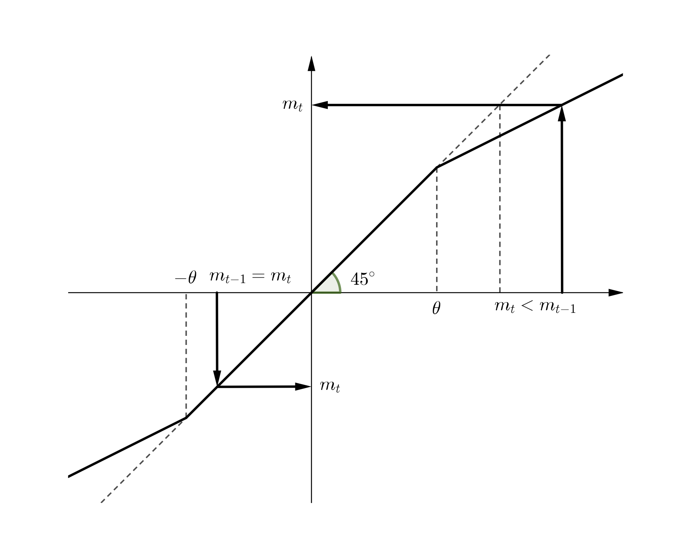

```{r setup, include=FALSE}
knitr::opts_chunk$set(echo = TRUE, warning = FALSE)
library(magrittr)
library(ggplot2)
library(foreach)
# Load a function that estimates TAR parameters.
source("../R/TAR_with_constant_threshold.R")
```

I would like to consider how to estimate an econometric model based on the Law of One Price. 

Suppose there are two markets and that there is one commodity (e.g. apple). If two markets are linked by trade and arbitrage, those two markets will have a common, unique price, provided there is no transportation cost.

Let $p_{i,t}$ and $p_j,t$ be prices of a commodity at time t in market $i$ and $j$, respectively, and $c_{ij,t}$ be the transportation cost between market $i$ and $j$ at time $t$. If market $i$ and $j$ are integrated, then
$$
\lvert p_{i, t} - p_{j, t}  \rvert \leq c_{ij, t}
$$
should hold. This is because if
$$
\lvert p_{i, t} - p_{j, t}  \rvert > c_{ij, t}
$$
holds, arbitrageurs have incentives to make arbitrage for profits. But as more and more arbitrages happen, the price spread shrinks so that it equals the transaction cost.

Thus I would like to have a model in which the price adjustment mechanism works only if the abusolute value of the eprice difference in the previous period exceeds the transaction cost. This can be modeled as follows:
$$
\begin{aligned}
m_{ij, t} - m_{ij, t-1} = 
	\begin{cases}
	\varepsilon_{ij, t} & (\lvert m_{ij, t-1} \rvert \leq \theta_{ij, t-1}) \\
	\rho m_{ij, t-1} + \varepsilon_{ij, t} & (\lvert m_{ij, t-1} \rvert > \theta_{ij, t-1})
	\end{cases},
\end{aligned}
$$
where $m_{ij,t} := p_{ij, t} - p_{ij, t-1}$. A graphical explanation of this model is in the figure below.

```{r pressure, echo=FALSE, out.width = '70%', fig.align="center"}

```

There are R libraries that such as ```tsDyn```, but the problem is that as far as I check, I cannot estimate the above model with the existing libraries. So it is necessary to write R codes tailored to my own need.


# TAR with constant threshold

First, I write a code that assumes $\theta_{t} = \theta$ for all $t$.

## Setting parameters

```{r}
# Set seed
set.seed(123)
# Number of observations + 1
n <- 101
# Draw data from normal distribution
y <- rnorm(n, mean = 0, sd = 10)
z <- rep(0, n)
e <- rnorm(n, mean = 0, sd = 5)
# AR parameter
rho <- -0.5
# Threshold value
theta <- 10
```

## Simulating data

We will simulate the data folling the data generating process below:

$$
\begin{aligned}
&m_{t} - m_{t-1} = \rho m_{t-1} \times 1 \{\lvert m_{t-1} \rvert > \theta  \} + \varepsilon_{t} \\
\Leftrightarrow \quad &m_{t} = (1 + \rho) m_{t-1} \times 1 \{\lvert m_{t-1} \rvert > \theta  \} + \varepsilon_{t},
\end{aligned}
$$
where $m_{t} := y_{t} - y_{t-1}$.

```{r}
# Make dataset
df <- tibble::tibble(y, z, e) %>%
  dplyr::mutate(L.y = dplyr::lag(y, k = 1)) %>%
  dplyr::mutate(m = y - L.y) %>%
  dplyr::mutate(t = 0:(n-1)) %>%
  dplyr::filter(!is.na(m))

for (i in 2:nrow(df)) {
  if (abs(df$m[i-1]) <= theta) {
    df$m[i] <- df$m[i-1] + df$e[i]
    df$z[i] <- 0
  }
  else if (df$m[i-1] < -theta) {
    df$m[i] <- (1 + rho) * df$m[i-1] + df$e[i]
    df$z[i] <- -1
  }
  else {
    df$m[i] <- (1 + rho) * df$m[i-1] + df$e[i]
    df$z[i] <- 1
  }
}
```


```{r}
# Plot the simulated data
ggplot(data = df, aes(x = t, y = m)) + 
  geom_line()
```


- $z_{t} = 1$ if $m_{t-1} > \theta$.
- $z_{t} = 0$ if $- \theta \leq m_{t-1} \leq \theta$.
- $z_{t} = -1$ if $m_{t-1} < - \theta$.

```{r}
# Plot to which regime each observation belongs.
ggplot(data = df, aes(x = t, y = z)) + 
  geom_point(size = 1)
```

## Estimating the parameters

The estimation of TAR model consists of the following steps:

1. The possible candidates for $\theta$ are selected from the $m_{t}$ in the data in such a way that at least 20% of observations are either within or outside the band formed by the thresholds. This means that to assure regime switching, you exclude the candidates which make almost all $m_{t}$ inside or outside the band.

1. For each candidate $\theta$, create a variable $z_{t} := 1 \{\lvert m_{t-1} \rvert > \theta \}$.

1. Compute $m_{t-1} \times z_{t}$.

1. Regress $m_{t} - m_{t-1}$ on $m_{t-1} \times z_{t}$. Compute the residual sum of squares ($RSS(\theta)$).

1. Select the model that minimizes $RSS(\theta)$.

The absolute value of $\rho$ measures the adjustment speed. In the literature of market integration with the autoregressive approach, it is conventional to report ‘halflife’ values to show how fast markets respond to arbitrage opportunities. A halflife value $h$ is defined by
$$
h := \frac{\ln(0.5)}{\ln(1 + \rho)},
$$
which measures how much time is needed for a given shock to return to half its initial value. The smaller $h$ is, the faster the adjustment is.


```{r}
# Estimation
result1 <- TAR_const(df$m)
theta1 <- round(result1$theta, digits = 3)
halflife1 <- round(result1$halflife, digits = 3)
# Regression table
stargazer::stargazer(
  result1$regression, 
  type = "text", 
  add.lines = list(c("Threshold Value", theta1), c("Halflife", halflife1))
)
```

Check if RSS is minimized around the true parameter.

```{r}
plot(result1$rssplot + ggplot2::geom_vline(xintercept = theta, linetype = "dotted"))
```

Compare the true and estimated parameters.

```{r}
# Compare the true and estimated parameters
comparison <- 
  data.frame(
    parameter = c("rho", "theta"),
    true = c(rho, theta),
    estimate = c(as.numeric(result1$regression$coefficients), theta1)
  )
comparison
```

